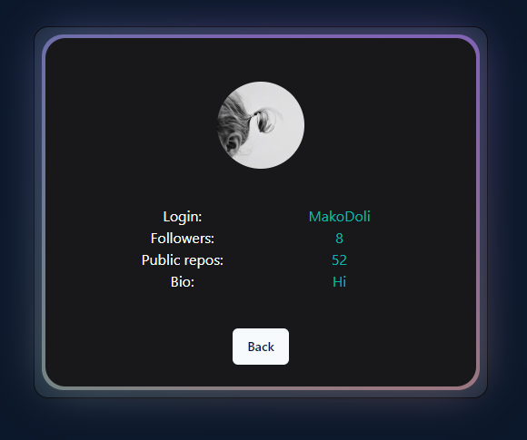

# Github User Search App

Welcome 👋 to the **Gihub User Search App** repository! 

This project was created with 
```
npm create vite@latest
```
uisng __React__ and  __TypeScript__
 
 with additional dependencies including Tailwind CSS, Tanstack Router, and Shadcn and Aceternity Libraries.

## Prerequisites

Before you begin, ensure you have met the following requirements:

- Node.js and npm installed on your local machine.

## Getting Started

To get a local copy up and running, follow these simple steps:

1. Clone the repository to your local project directory using the following command:

```
git clone https://github.com/your-username/project-name.git
```


Install dependencies using npm:

```
npm install
```

In order to use Aceternity library run
```
npm i framer-motion clsx 
npm i framer-motion clsx tailwind-merge @tsparticles/react @tsparticles/engine @tsparticles/slim
```

## Running the Application

To run the application locally, execute the following command:


```
npm run dev
```
This will start the development server. You can view the application by opening http://localhost:3000 in your web browser.


 **Github User Seacrh App**  allows you to search for github user by entering github username in input field


You can choose how many results to display. After clicking user name you are directed to the page which displays user info with available link to user's github account



You can switch between light and dark mode

The project is build with __tailwindcss__ and UI libraries such as __Shadcn__ and __Aceternity__ . 

I used __Tanstack__ router for page navigation and __Context API__ for data access.


